# Medix

download link: https://drive.google.com/file/d/1rrFuI3bTv50krEhTLuMzRIym0wLQu5Hp/view?usp=sharing

developed an android app in Kotlin, that allows doctors and patients from anywhere around the world to connect
and provide a means for virtual consultations using voice calls and video calls.
The app allows messaging between doctors and patients in real time.

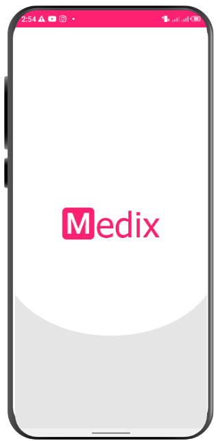      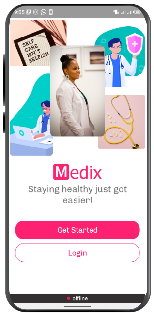      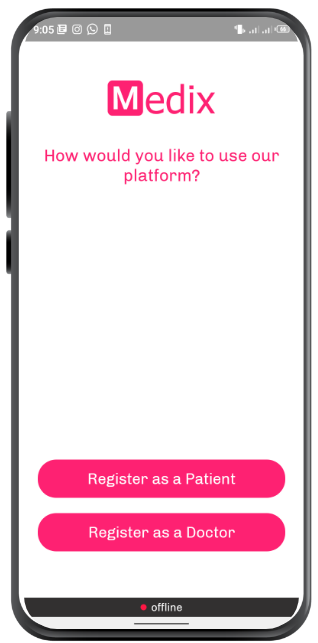

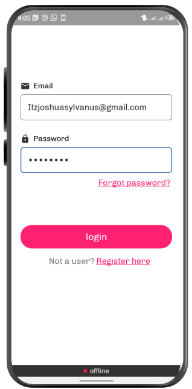      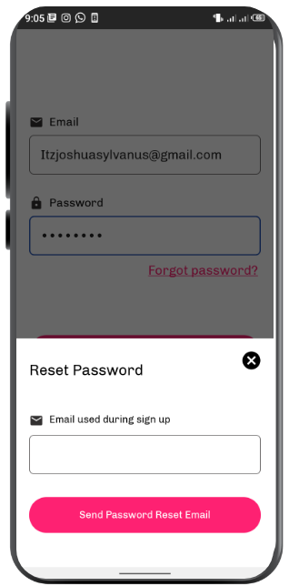      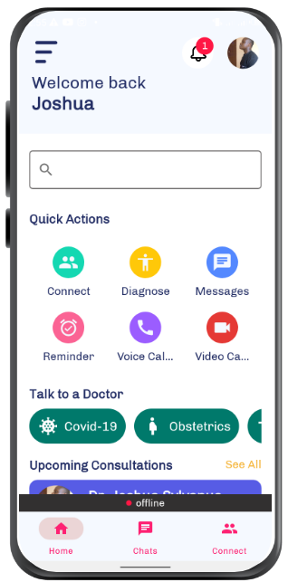

 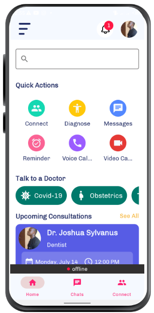       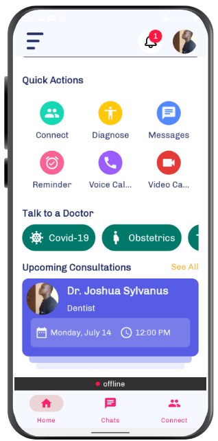      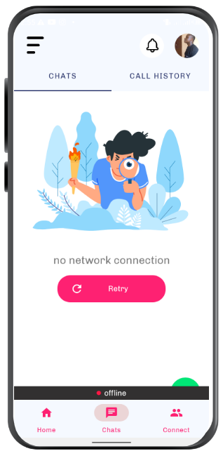
 
 
 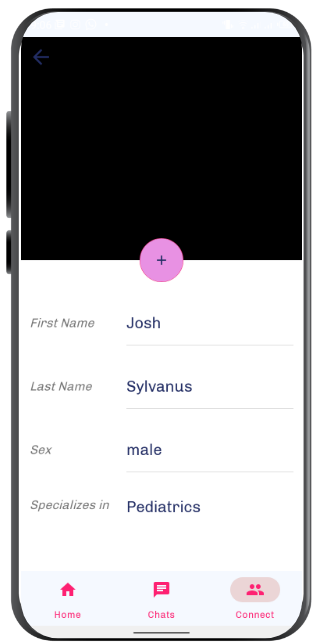       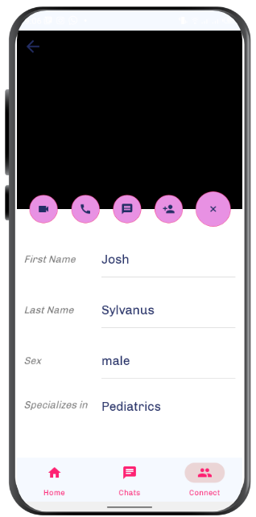
